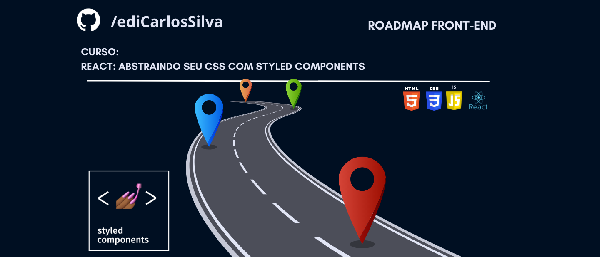

<h1 align="center"> Curso styled-components</h1>

## Descrição do Projeto 

### Projeto para desenvolver os conhecimentos de [styled-componentes](https://styled-components.com/docs). Documentar o conhecimentos adquiridos ao longo da jornada.

 

<h4 align="center">
    :construction:  Projeto em construção  :construction:
</h4>

## Conteúdo estudado
* [Descrição do Projeto](#Descrição-do-Projeto)
* [Autor](#Autor)

# :hammer: Funcionalidades do projeto

- `Funcionalidade 1`: descrição da funcionalidade 1

## 📁 Acesso ao projeto

Você pode [acessar o código fonte do projeto inicial](https://github.com/ediCarlosSilva/styled-components) ou [baixá-lo](https://github.com/ediCarlosSilva/styled-components/archive/refs/heads/main.zip).

## 🛠️ Abrir e rodar o projeto

Após baixar o projeto, acesse a pasta do projeto pelo terminal de comandos.

- instale as dependências com o comando `npm install`
- Após a instalação das depências execute o comando: `npm start`
- Acesse o projeto pelo navegador. Geralmente [http://localhost:3000](http://localhost:3000)

## ✔️ Técnicas e tecnologias utilizadas

- ``Javascript``
- ``React``
- ``Styled-components``

# Autor

| [ Edi Carlos da Silva](https://github.com/ediCarlosSilva) |
| :---: |

